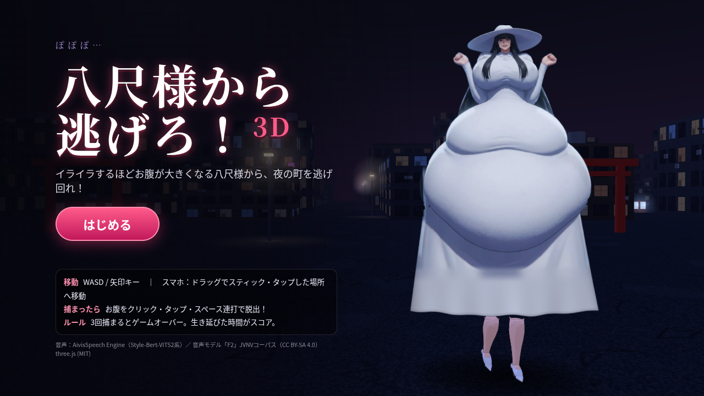
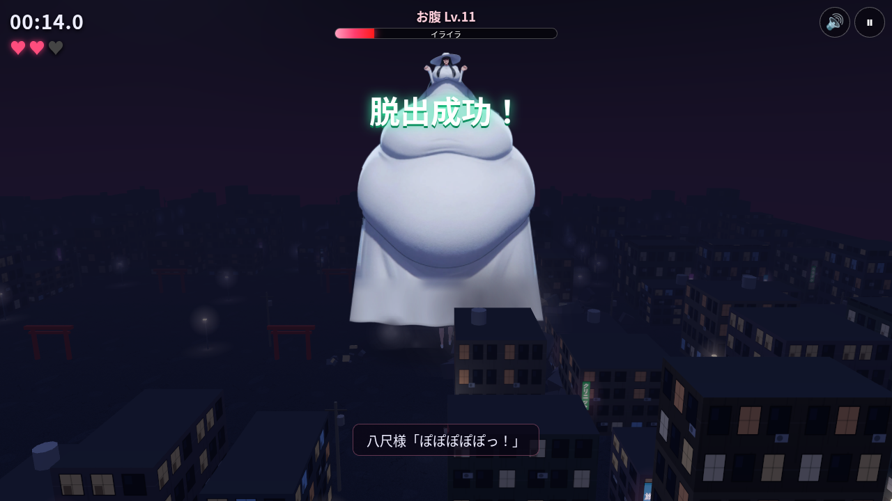

# 八尺様から逃げろ！3D

お腹が大きすぎる八尺様から、夜の町をひたすら逃げ回るブラウザ用の疑似3Dアクションゲームです。

**▶ 遊ぶ：** https://msttzgw929-arch.github.io/hachishaku-3d/

## 遊び方
- 八尺様から逃げて、できるだけ長く生き延びましょう。生存時間がスコアになります。
- 捕まると抱きしめられて動けなくなります。お腹を**連打**（タップ／クリック／スペースキー）すると脱出できます。脱出したあとは少しのあいだ無敵です。
- 逃げられ続けると八尺様はだんだん**イライラ**してきて、そのたびにお腹がどんどん大きくなっていきます（上限はありません）。巨大になったお腹は建物をなぎ倒します。
- 3回捕まるとゲームオーバーです。

## 操作
| | PC | スマホ |
|---|---|---|
| 移動 | WASD／矢印キー | 画面のどこかをドラッグ（バーチャルスティック）またはタップした地点へ移動 |
| 脱出（捕まったとき） | スペースキー／クリック連打 | タップ連打 |
| 一時停止 | Esc／P | 右上の ❚❚ ボタン |

## 技術メモ
- three.js（r170、`vendor/` に同梱）を使い、ビルドなしで動く静的サイトです。
- 八尺様は元のイラストをパーツ（上半身・お腹・スカート）に分けています。頂点シェーダーで、お腹のバネ揺れ、腕の振り、呼吸、スカートのなびきを動かしています。表情は同じ画風で描き直した差分を切り替えており、ボイスに合わせて口パクとまばたきをします。
- 脚（ハイヒール）はトゥーンシェーディングの3Dで描き足しました。2ボーンIKでかかとからつま先へ体重を移す歩き方にしています。
- ローカルで動かすには、`python3 -m http.server` を実行してから `http://localhost:8000/` を開いてください。

## クレジット・ライセンス
- 音声合成：[AivisSpeech Engine](https://github.com/Aivis-Project/AivisSpeech-Engine)（Style-Bert-VITS2系）
- 音声モデル：「F2」（JVNVコーパス由来、CC BY-SA 4.0）。`assets/voice/` にある音声ファイルは CC BY-SA 4.0 で配布しています。
  - JVNV: Detai Xin et al., "JVNV: A Corpus of Japanese Emotional Speech with Verbal Content and Nonverbal Expressions"（CC BY-SA 4.0）
- [three.js](https://threejs.org/)：MIT License
- 効果音とBGMはすべて Web Audio でリアルタイムに合成しています。
- 非公式のファンメイド作品です。
